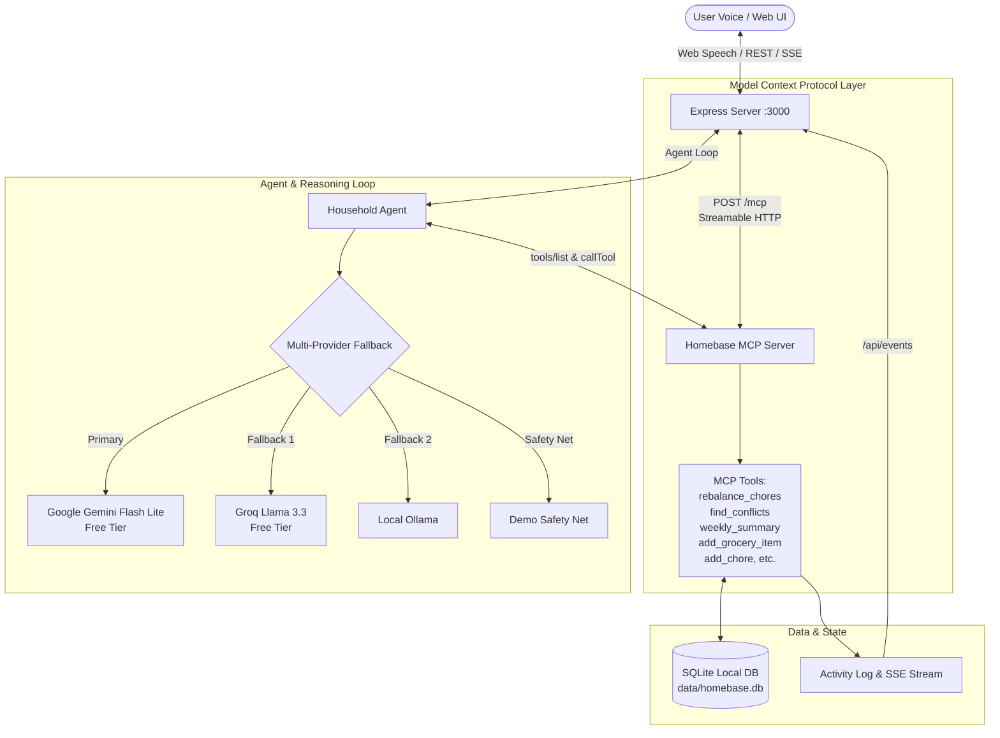

# Homebase — Household Chief of Staff

> **Amazon Developer Hackathon — Alexa+ Track Submission**  
> An open, voice-first household assistant managing chores, groceries, calendars, and reminders. Homebase exposes all household intelligence as **Model Context Protocol (MCP) tools over Streamable HTTP**, with an open **Agent Skill** specification and an Amazon-inspired dashboard. Built strictly within a **$0 budget** (no credit card required) using free-tier LLM providers.

[](https://modelcontextprotocol.io)
[](file:///skill/skill.json)
[](#zero-cost--privacy)
[](package.json)

---

## 🌟 The Pitch

Modern family logistics are fractured across sticky notes, messaging groups, and isolated calendar apps. Parents shoulder invisible mental burdens, schedules constantly collide, and chore assignments turn into daily arguments.

**Homebase** acts as an AI Chief of Staff for the home. Powered by **MCP over Streamable HTTP** and compatible with Alexa+:
1. **Effort-Balanced Chores (`rebalance_chores`)**: Rebalances household chores across family members by effort points while respecting age roles (`kid` $\le 2$ pts, `teen` $\le 3$ pts, `parent` $\le 5$ pts).
2. **Proactive Conflict Spotting (`find_conflicts`)**: Detects double-booked members and pinpoints schedule breakdowns when a parent travels (e.g., *"Dad's traveling Thursday, what does that break?"*).
3. **Weekly Briefing (`weekly_summary`)**: Aggregates schedules, open chores, needed groceries by store section, and active reminders into a single coherent briefing.
4. **Natural Voice Interaction**: Real-time voice input via the Web Speech API and spoken replies via SpeechSynthesis.

---

## 🏛️ System Architecture



---

## 🚀 Setup in Under 5 Commands

### 1. Clone the repository
```bash
git clone https://github.com/notDeboatall/amazon-project.git
cd amazon-project
```

### 2. Install dependencies
```bash
npm install
```

### 3. Configure API Key (Optional)
```bash
cp .env.example .env
# Add your free Gemini API key:
# GEMINI_API_KEY="your-free-gemini-api-key"
```
*(Note: If no API key is provided, Homebase automatically runs using its built-in scripted demo safety net!)*

### 4. Start the application
```bash
npm run dev
```

### 5. Open in browser
Visit **[http://localhost:3000](http://localhost:3000)** to experience the voice-first assistant.

---

## 🎬 Rehearsed Demo Script (Try These Exact Prompts)

Homebase is seeded with a realistic fictional family: **The Sharma-Rao household** (Arjun - Dad, Meera - Mom, Riya - Teen 15, Kabir - Kid 9).

Click **"Reset demo"** in the top navigation strip at any time to return to the clean initial demo state, then try these 5 prompts:

| Step | Prompt (Voice or Text) | Expected Assistant Action |
|:---:|:---|:---|
| **1** | *"We're out of milk and eggs."* | Calls `add_grocery_item` twice; categorizes into `dairy`; merges into the shared grocery list. |
| **2** | *"Assign dishes and laundry fairly this week."* | Calls `rebalance_chores`; redistributes open chore effort evenly: Arjun (7 pts), Meera (7 pts), Riya (4 pts), Kabir (2 pts). |
| **3** | *"Dad's traveling Thursday, what does that break?"* | Calls `find_conflicts`; detects Arjun's double-booking between Riya's football pickup (5:00 PM) and Kabir's dentist (5:30 PM); proposes Meera take over both or reschedule. |
| **4** | *"Remind Meera about the dentist on Thursday at 4."* | Calls `create_reminder`; schedules a reminder for Meera on Thursday at 4:00 PM. |
| **5** | *"What's happening this week?"* | Calls `weekly_summary`; aggregates events, open chores, needed groceries, and flags the Thursday conflict. |

You can also run the automated rehearsal test suite directly:
```bash
npm run rehearse
```

---

## 🛠️ Verification & Test Suite

Homebase includes end-to-end automated testing covering all layers:

```bash
# 1. Typecheck the entire codebase (TypeScript Strict)
npm run typecheck

# 2. Run the MCP Client smoke test (all 12 MCP tools over Streamable HTTP)
npm run smoke

# 3. Test 15 realistic household prompts end-to-end
npm run test:prompts

# 4. Test Phase 4 standout prompt flows
npm run test:standout

# 5. Run the 3-round demo rehearsal test
npm run rehearse
```

---

## 🔌 Connecting via External MCP Clients (Inspector)

Homebase follows the official Model Context Protocol 2024-11-05 specification. You can connect any external MCP client or the official MCP Inspector to inspect and execute tools:

```bash
npx @modelcontextprotocol/inspector
```
1. Select Transport: **Streamable HTTP**
2. Server URL: `http://localhost:3000/mcp`
3. Click **Connect** to see and invoke all 12 registered tools:
   - `list_members`, `add_chore`, `assign_chore`, `complete_chore`, `rebalance_chores`
   - `add_grocery_item`, `list_groceries`
   - `add_event`, `list_events`, `find_conflicts`
   - `create_reminder`, `weekly_summary`

---

## 📦 Agent Skill Packaging

Homebase includes a complete Agent Skill specification ready for Alexa+ and MCP-compatible agent runtimes:
- **Manifest:** [`skill/skill.json`](file:///skill/skill.json) — Declares protocol version, Streamable HTTP endpoint, tool schemas, intent sample utterances, and local privacy constraints.
- **Specification:** [`skill/SKILL.md`](file:///skill/SKILL.md) — Comprehensive workflow guidelines and role-weighted execution model.

---

## 💰 Zero-Cost & Privacy Guarantees

- **$0 Budget Required:** Operates on the free tier of Google AI Studio (`gemini-flash-lite-latest`), Groq (`llama-3.3-70b-versatile`), or local Ollama.
- **No Credit Card:** Can be evaluated without entering any payment information.
- **Local-First SQLite:** All family state is stored on your local disk (`data/homebase.db`).
- **Fake Demo Data Only:** Pre-seeded with the fictional Sharma-Rao family for repeatable evaluation.

---

## 👥 Hackathon Track Information

- **Track:** Alexa+ (Amazon Developer Hackathon)
- **Repository:** [https://github.com/notDeboatall/amazon-project.git](https://github.com/notDeboatall/amazon-project.git)
- **License:** MIT
